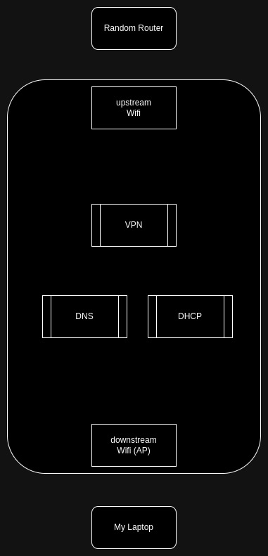

# Bouncer Box

## Overview

The purpose of this box is to serve as a portable AP/firewall that you can rely on when traveling.  
It contains some basic services to keep your devices isolated from whatever network you want to connect to while on the
go, enabling you to have your "local network" wherever you are.



Basically it runs:

- Downstream AP to enable your devices to connect to
- DNS server (dnsmasq)
- DHCP server (dnsmasq)
- VPN (openvpn) _[optional]_

## Requirements

On top of the Pi device, which already has a wireless interface, a second WiFi dongle is necessary to connect to the
upstream AP.

## Set up

Using the current last version of RaspiOS Lite. You could use the full one if you want X through VNC, but I didn't find
it necessary yet.

Create the file `hostlist.txt`, and set the MAC address of the wireless interface of your Pi, the integrated one.

I use [Mullvad](https://mullvad.net/) as the VPN provider on the Pi, you can use any other that offers `.ovpn` config
files. Update the VPN config files folder if necessary.

Then customize the image:

```
./ezsdm.sh 2024-07-04-raspios-bookworm-arm64-lite.img 
```

Then burn it into your SD:

```
sudo sdm --burn /dev/sdX 2024-07-04-raspios-bookworm-arm64-lite.img 
```

## First boot

The first time it boots, everything will be set up (props to [sdm](https://github.com/gitbls/sdm)
and [ndm](https://github.com/gitbls/ndm)!) and it will reboot immediately.

Normally, the downstream AP should be already active, and we could connect to it.   
I sometimes have some issues on the first run, and for that reason I also include a `.nmconnection` which I control(my
phone), so after the first boot, I let the Pi connect to my phone's AP, and from there I ssh into the Pi.    
At this point, the downstream is already active, and it will always be after boot.

## Use

- Power up your Pi
- Connect to the downstream AP
- SSH into the box
- If you are in a new location: `./connect.sh`
- If your Pi already knows this place: `./route.sh`
- Happy browsing!

At any time, you can run `./route.sh` to decide if you want to use VPN or not.

### Captive portals

Some networks have a captive portal and force you to put in a password in a login page, or click some button.
For that, `lynx` can be used. Since it has JS support, it enables to render those pages, normally rather simply.

## Known issues

### No AP active after first boot

I tried figuring the issue out... but without a physical monitor is hard. The workaround described above works to me,
since it's a one time thing, when setting things up. Eventually might look into it.

### Changing VPN exit country

When a tunnel is already set, if you want to change the tunnel, you need to disconnect and connect. Needs fix to be
auto.

### Re-enter password for known APs

If you `./connect.sh` and use an already known AP, it still asks you for password. Needs to check the current known to
avoid that.


